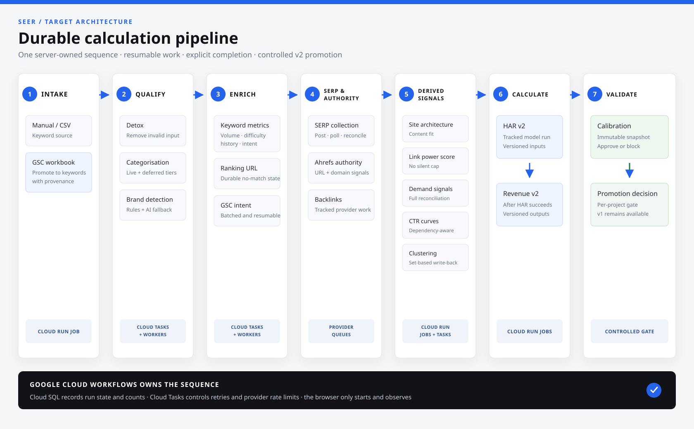

# SEER Google Cloud Migration Technical Plan

Status: internal planning baseline  
Prepared from: repository `main`, the Calculation v2/v2.1 handover, the two prompt sequences, and the orchestration audits  
Target: full removal of Lovable and Supabase runtime dependencies, plus a durable automated SEER calculation pipeline  
Execution state: no Google Cloud project has been created and no production migration has started

## 1. Outcome

SEER will run as a Google Cloud application with:

- a React single-page application hosted on Firebase Hosting;
- Identity Platform for authentication;
- a private Cloud Run API as the only application data boundary;
- Cloud SQL for PostgreSQL as the system of record;
- Cloud Storage for client logos and slide-export assets;
- Cloud Run workers and jobs for all calculation and integration workloads;
- Workflows as the durable pipeline orchestrator;
- Cloud Tasks for controlled, retryable provider calls and per-item work;
- Cloud Scheduler for recurring operational jobs;
- Secret Manager for credentials;
- Cloud Logging and Cloud Monitoring for operational visibility;
- Cloud Build and Artifact Registry for repeatable deployments.

The migration must preserve the current client-facing v1 behaviour while the v2.1 engine continues in shadow mode. The new automated pipeline will then make the complete v2 sequence durable, resumable and observable. Client-facing promotion of v2 remains a separate controlled gate.

### Hard constraint: zero Supabase in the target

Supabase is only the source from which data, users, files and effective configuration are extracted during migration. It is not part of the staging or production target architecture.

The target must have:

- no Supabase database, authentication, storage, Edge Function or scheduling dependency;
- no `@supabase/supabase-js` production dependency;
- no Supabase URL, key, token or hostname in deployed frontend or backend configuration;
- no hybrid reads, writes, authentication fallback or long-lived dual-running mode;
- no rollback path that sends the migrated application back to Supabase after Google Cloud production writes begin.

## 2. Verified baseline

The repository contains:

| Asset | Repository baseline |
|---|---:|
| React/Vite frontend source files | 220 |
| Supabase Edge Functions | 38 |
| Shared calculation/orchestration modules | 18 |
| Shared pure-module tests | 15 |
| Application tables | 58 |
| SQL migrations | 95 |
| Unique SQL functions found in migrations | 28 |
| Historical `CREATE POLICY` statements | 165 |
| Historical index definitions | 93 |
| Database triggers | 17 |
| PostgreSQL extensions | `pg_cron`, `pg_net`, `pg_trgm` |
| Storage buckets | `client-logos`, `slide-exports` |
| Test files across unit, integration-style and E2E suites | 32 |

Important architecture facts:

- The browser uses `@supabase/supabase-js` directly for authentication, table access, RPC calls, storage and Edge Function invocations.
- There is no application API tier.
- The frontend contains the dependency order and continuation loops for Smart Sync.
- v1 remains the source for client-facing forecast pages.
- v2.1 is implemented as a backend/admin shadow engine and writes versioned scenario rows.
- The v2.1 calculation modules are deterministic and unit-tested; they should be moved with minimal mathematical change.
- The live Supabase environment has not yet been inspected for this plan. Repository migrations and generated types are a baseline, not a substitute for a production schema, policy, size and row-count dump.

## 3. Scope

### Included

- Hosting, domain routing and TLS.
- Authentication, password migration, invitations, password reset, approval state and roles.
- All application data, SQL functions, constraints, indexes, triggers and required PostgreSQL extensions.
- Both storage buckets and their object metadata.
- All 38 Edge Functions and the 18 shared modules.
- Existing recurring jobs and background processing.
- All external integrations currently used by the application.
- Frontend replacement of direct Supabase access with authenticated API calls.
- CI/CD, infrastructure as code, secrets, logs, metrics, alerts, backups and recovery.
- The durable pipeline from keyword intake through calibration.
- GSC-upload-to-keywords promotion, which does not exist today.
- Resumability and completion contracts for enrichment, ranking URL lookup, GSC intent, site architecture, LPS, demand signals, HAR v2 and Revenue v2.
- A production cutover with explicit validation and rollback gates.

### Deferred unless separately approved

- GA4 API integration.
- Direct GSC API integration; the current workbook import remains supported.
- Fully automatic keyword-universe ingestion.
- LLM-generated numeric forecasts.
- The unstarted v2.1 Phase 3 product features: conversion funnels, competitor-gap discovery, GSC long-tail discovery, additional SERP-overlap clustering, cannibalisation-aware v2 rollup and SERP volatility.
- A broad UI redesign.
- Retuning calculation thresholds or changing the proven v2.1 formula during infrastructure migration.

## 4. Why the current sequence fails

The current Smart Sync hook has eight browser-owned phases:

1. keyword detox;
2. categorisation;
3. enrichment;
4. ranking URLs;
5. v1 HAR/SERP refresh;
6. GSC intent enrichment;
7. v1 forecast recomputation;
8. site architecture.

The browser decides freshness, invokes functions, polls job tables, sleeps during rate limits, detects stalls and clears project dirty flags. Closing the tab stops any stage that is not already backed by a server worker.

Current durability by stage:

| Stage | Current behaviour | Required correction |
|---|---|---|
| GSC promotion | Missing entirely | Add an idempotent promotion stage before qualification |
| Detox | Server-driven, resumable | Port worker semantics and fix honest terminal-state handling |
| Categorisation | Server-driven; the legacy terminal-state defect is corrected locally but not released | Port the corrected retry, fallback, error and reconciliation contract |
| Enrichment | Up to 200 browser invocations | Move to server queue with stored progress |
| Ranking URL lookup | One request, no completion contract | Add queued work, retry and terminal state |
| GSC intent | One synchronous request | Add batches, resume and status |
| SERP/Ahrefs/backlinks | Durable inside v1 HAR worker | Separate data collection from v1 calculation and port it |
| Site architecture | Up to 40 browser invocations; 10,000-row ceiling | Queue per-item work and isolate malformed/rate-limited AI responses |
| LPS | Silent 5,000-keyword cap | Remove cap, partition work and report truncation |
| Demand signals | Silent 5,000-keyword cap | Remove cap, partition work and report truncation |
| CTR curves | Manual admin trigger | Make dependency-aware and repeatable |
| Clustering | Manual and slow write-back | Make set-based, tracked and safe at target scale |
| HAR v2 | Synchronous | Run as a tracked Cloud Run Job |
| Revenue v2 | Synchronous | Run as a tracked Cloud Run Job after all dependencies |
| Calibration | Manual | Make the final promotion gate in the workflow |
| Overall orchestration | Implemented in React | Replace with a server-owned Workflows DAG |

The current sequence also computes v1 forecasts before site-architecture scoring. That order cannot be carried into the v2 pipeline because content fit is a HAR v2 input.

The local legacy containment fix added on 2026-07-29 removes two immediate false-success paths without changing the target architecture:

- the worker now receives the incremented keyword attempt count, preserves attempts when work is deferred or rate-limited, records low-confidence fallbacks separately and fails when unresolved rows are no longer claimable;
- the browser no longer marks categorisation complete after a fixed polling window. It waits for a terminal job, detects stalls from processed-count progress and reconciles unresolved rows before advancing.

This fix still requires a controlled source-environment release. It does not make the remaining browser-owned stages durable and is not a substitute for the Google Cloud workflow.

## 5. Target architecture

### 5.1 Service mapping

| Current dependency | Google Cloud target | Migration decision |
|---|---|---|
| Lovable SPA hosting | Firebase Hosting | Static Vite build, SPA rewrites, custom domain and managed TLS |
| Lovable preview/deployment metadata | Cloud Build + Firebase preview channels | Remove Lovable-specific deployment assumptions |
| Supabase Auth | Identity Platform / Firebase Authentication SDK | Preserve user UID and bcrypt password hash where export succeeds |
| Supabase PostgREST from the browser | Cloud Run API | No browser-to-database access in the target |
| Supabase PostgreSQL | Cloud SQL for PostgreSQL | Preserve relational model and deterministic SQL behaviour |
| Supabase RLS with `auth.uid()` | API token validation plus Cloud SQL transaction context | Rewrite policies/functions around a trusted request UID and role |
| Supabase Edge Functions | Cloud Run API, workers and jobs | Split by request/worker/batch execution profile |
| `EdgeRuntime.waitUntil` self-chaining | Cloud Tasks and Cloud Run Jobs | Managed retry, rate control and durable execution |
| `pg_cron` and `pg_net` | Cloud Scheduler and Workflows | Remove HTTP scheduling from the database |
| Smart Sync React hook | Workflows | One canonical dependency graph outside the browser |
| Supabase Storage | Cloud Storage | Private buckets, signed upload/download URLs |
| Lovable AI Gateway | Anthropic API from Cloud Run | Replace the gateway with a pinned server-side request/response contract; a Vertex partner-model route remains an optional later change |
| Lovable Google connector gateway | Direct Google Drive and Slides APIs | Use Workspace-approved OAuth or domain delegation |
| Supabase secrets | Secret Manager | Versioned secrets and least-privilege access |
| Edge Function logs | Cloud Logging, Monitoring and Error Reporting | Structured run and stage correlation |
| Supabase/Lovable deployment | Cloud Build + Artifact Registry | Immutable container revisions and gated deployment |

### 5.2 Environment layout

Create two isolated Google Cloud projects:

- `seer-staging`: migration rehearsals, integration tests and scale tests;
- `seer-production`: production identity, data and runtime.

The proposed primary region is `europe-west2` (London) for Cloud Run, Cloud SQL, Workflows, Cloud Tasks and Scheduler. The final region must be confirmed against client data-residency and provider-network requirements before resource creation.

No existing Turing Labs or other client project should be reused.

### 5.3 Runtime components

| Component | Responsibility |
|---|---|
| `seer-web` | Firebase Hosting site containing the Vite build |
| `seer-api` | Cloud Run service for authenticated application and admin APIs |
| `seer-worker` | Private Cloud Run service receiving Cloud Tasks work |
| `seer-pipeline` | Workflows definition for the project calculation DAG |
| `seer-batch` | One versioned container image used by named Cloud Run Jobs |
| `seer-db` | Private Cloud SQL PostgreSQL instance |
| `seer-assets` | Cloud Storage bucket for private logos and application assets |
| `seer-exports` | Cloud Storage bucket for temporary slide-export images |
| provider queues | Cloud Tasks queues separated by DataForSEO, Ahrefs and AI rate profile |
| event topics | Pub/Sub topics for completion, failure and operational events where more than one consumer is required |

The API and workers use separate service accounts. The frontend has no database credentials. Cloud SQL uses private connectivity and IAM database authentication for runtime service accounts.

### 5.4 Local target proof

The deployment boundaries were implemented and validated locally before cloud resource creation. The Docker stack uses isolated adapters with direct production mappings:

| Validated locally | Managed target |
|---|---|
| PostgreSQL with separate runtime roles | Cloud SQL with separate service identities |
| Local identity service contract | Identity Platform |
| Private filesystem object service | Cloud Storage |
| Leased PostgreSQL task queue | Cloud Tasks |
| Transactional outbox relay | Pub/Sub |
| Node API, worker and gateway containers | Cloud Run and Firebase Hosting |

The validation completed registration and login, private object write/read, all 19 data-driven pipeline stages, 19 event deliveries, idempotent task redelivery and a full container restart with state preserved. The stages atomically persist intake through calibration, including controlled provider inputs, versioned calculation outputs and scenario summaries. HAR v2.1, Revenue v2.1 and calibration now use exact parity-checked copies of the source pure modules. The dispatcher and event relay recover from transient database unavailability during a restart. All local schema indexes were ready, and automated scans found no forbidden source-provider dependency in the target package, rendered Compose configuration, running containers or built image.

The same project-backed path completed with 18,000 keywords and persisted 54,000 HAR plus 54,000 Revenue scenario rows without truncation. A validated OpenTofu module now defines the private network, Cloud SQL, Cloud Storage, Identity Platform, Firebase Hosting, Cloud Run, queues, event topic, secrets and service identities. The Workflows template contains the exact ordered 19-stage pipeline, authenticated worker delivery, retries and terminal failure recording. Managed API adapters exist for Identity Platform token verification, Cloud Storage access and Workflows execution.

This proves the target service structure, canonical calculation code, pipeline durability, provider adapter contracts, frontend API boundary and scale contracts. It does not mark production parity complete: production identity/data/storage import, the effective live business schema, credential-backed provider calls and frozen real-project output parity remain governed by the inventory and acceptance gates.

## 6. Database migration design

### 6.1 Preserve the relational system of record

Cloud SQL remains PostgreSQL. The 58 application tables, their relationships and the calculation outputs move to Cloud SQL. The initial target is schema and behavioural parity, not a data-model rewrite.

The target schema will be produced as a consolidated Cloud SQL baseline migration. Replaying all 95 Supabase migrations is not acceptable because they include obsolete policy versions, Supabase-specific auth references, `pg_net` calls and replaced cron schedules.

### 6.2 Authentication references

Supabase Auth stores users under `auth.users`; application tables reference the same UUID through `profiles`, `user_roles` and `user_client_access`.

Target design:

- import each Identity Platform account with the same UUID as its UID;
- retain `profiles.id` as the local application user key;
- make application foreign keys reference `profiles`, not `auth.users`;
- create and update profiles from trusted API/admin flows;
- keep business role and client-access data in Cloud SQL;
- optionally mirror the coarse role into Identity Platform custom claims for fast UI decisions;
- always enforce project/client access in the backend and database.

### 6.3 Authorization and RLS

Current RLS depends on Supabase JWT helpers and database roles. The target uses:

1. the API verifies the Identity Platform ID token;
2. the API resolves approval, role and client access;
3. every database request runs inside a transaction;
4. the transaction sets trusted local values such as `app.user_id` and `app.role`;
5. rewritten SQL helpers read those transaction-local values;
6. RLS policies and explicit query predicates enforce the same visibility rules;
7. workers use a separate database role with only the privileges required for background work.

Connection-pool code must use transaction-local settings so identity cannot leak between requests.

### 6.4 SQL objects

- Keep `pg_trgm` if the live compatibility check confirms the same query plans.
- Retire `pg_cron`; Cloud Scheduler and Workflows own scheduling.
- Retire `pg_net`; the database must not make runtime HTTP calls.
- Port deterministic SQL helpers, archive operations, coverage queries, bulk updates and URL-issue detection.
- Adapt or retire Supabase-specific auth functions and triggers.
- Keep atomic claim/update helpers only where they still add value beneath Cloud Tasks.
- Rebuild and verify all required indexes before scale testing.
- Compare `EXPLAIN (ANALYZE, BUFFERS)` plans for the broad project queries, queue claims, upserts, rollups and forecast reads.

### 6.5 Transfer method

Preferred path:

1. use Database Migration Service continuous PostgreSQL migration if Supabase networking and logical replication settings permit it;
2. otherwise use a controlled `pg_dump`/restore rehearsal and a production write-freeze for the final delta.

The decision is made only after checking:

- production PostgreSQL version;
- database size and table sizes;
- logical replication access;
- required extensions;
- ownership and grants;
- large objects and sequences;
- Supabase-managed schemas that must not be copied;
- source network allowlisting.

Database Migration Service does not migrate the operational meaning of Supabase Auth, Storage, `pg_cron` or `pg_net`; each is migrated separately.

## 7. Authentication migration

### 7.1 User import

Supabase stores password hashes with bcrypt. Identity Platform supports bulk import of bcrypt hashes.

Migration procedure:

1. export the minimum required columns from `auth.users` through a privileged, audited process;
2. preserve the UUID as the Identity Platform UID;
3. import email, email verification state, disabled state, metadata and bcrypt hash;
4. import the application role as a custom claim where useful;
5. retain approval state and client access in Cloud SQL;
6. validate a controlled sample of real logins in staging;
7. produce a failed-user report without exposing password hashes;
8. send password-reset links only for accounts whose hash cannot be imported.

Existing Supabase sessions will not be accepted by the new backend. Users sign in again at cutover.

### 7.2 Application flows to port

- email/password sign-in and sign-up;
- email confirmation;
- password reset and password change;
- pending, approved and rejected account states;
- admin approval and rejection;
- admin invite;
- user list and deletion;
- role assignment;
- per-client access assignment;
- forced token refresh after role changes;
- server-side ID-token validation on every API call.

## 8. Storage migration

Current buckets:

| Bucket | Target | Access model |
|---|---|---|
| `client-logos` | `seer-assets` prefix `client-logos/` | Private; short-lived signed read/upload URLs |
| `slide-exports` | `seer-exports` | Private; short-lived signed URLs and lifecycle deletion |

Procedure:

1. inventory object count, total bytes, MIME types, paths and orphaned objects;
2. copy objects while preserving path and content type;
3. calculate and compare hashes where available;
4. rewrite stored object references;
5. replace direct browser upload with API-issued signed upload URLs;
6. verify archive and hard-delete behaviour against Cloud Storage;
7. add soft-delete/lifecycle rules appropriate to each bucket;
8. retain a source export until the cutover acceptance gate closes.

## 9. Edge Function migration

### 9.1 API functions

Move request/response and administrative behaviour into `seer-api`:

- user administration;
- archive/restore/hard-delete commands;
- reference-data mutations;
- GSC workbook upload initiation;
- CTR benchmark requests;
- conversion overrides;
- project/client CRUD;
- status and run-history reads;
- signed storage URL issuance;
- slide-export request creation.

### 9.2 Worker functions

Move retryable provider and per-item work into `seer-worker`, invoked by Cloud Tasks:

- detox;
- categorisation;
- brand classification ambiguity resolution;
- keyword enrichment;
- ranking URL lookup;
- GSC intent enrichment;
- SERP post/poll;
- Ahrefs authority;
- backlink collection;
- site-architecture scoring;
- external AI content generation where it is not an interactive request.

Provider queues must have independent concurrency and retry policies. Task names use stable idempotency keys based on stage run, entity and operation.

### 9.3 Cloud Run Jobs

Move bounded batch calculations and backfills into named Cloud Run Jobs:

- GSC-to-keywords promotion;
- historical-volume backfill;
- base-rank and authority backfills;
- CTR curve construction;
- LPS computation;
- demand-signal computation;
- set-based keyword clustering;
- HAR v2;
- Revenue v2;
- calibration;
- legacy v1 compute while client-facing parity is required;
- content plan and roadmap batch generation where appropriate;
- URL-monitor pruning.

Each job writes durable progress and links its Cloud Run execution ID to a stage-run record.

### 9.4 Pure calculation modules

The 18 shared modules move into a backend package without formula changes. Model versions remain defined in one shared location. Existing unit tests are retained and expanded with frozen input/output fixtures taken from verified runs.

The migration must not silently change:

- HAR scenario thresholds and temperatures;
- `p_att` semantics;
- confidence-band semantics;
- CTR resolver order or monotonicity clamp;
- SERP visibility treatment;
- conversion override precedence;
- trend adjustment;
- cluster canonical selection;
- model version strings.

## 10. Durable v2 pipeline

### 10.1 Canonical dependency graph

Ordering rules:

- GSC promotion precedes every stage that reads `keywords`.
- Brand classification precedes CTR-curve construction.
- Enrichment precedes clustering and trend/demand computation.
- Ranking URL and site architecture complete before HAR v2.
- SERP and authority collection complete before LPS and HAR v2.
- LPS completes before HAR v2.
- Demand signals and CTR curves complete before Revenue v2.
- HAR v2 completes before Revenue v2.
- Revenue v2 completes before calibration.
- Calibration never changes the model; it approves or blocks promotion.

### 10.2 State model

Add a canonical state layer:

- `pipeline_runs`: one requested end-to-end project run;
- `pipeline_stage_runs`: one row per stage with status, attempts, counts, timing, freshness fingerprint and error;
- `pipeline_work_items`: durable per-entity or per-batch item state where a provider stage requires it;
- `pipeline_events`: append-only audit/outbox events;
- existing `calc_run_registry`: retained for model-versioned HAR/Revenue runs and linked to the pipeline stage.

Standard states:

`queued`, `running`, `waiting`, `succeeded`, `failed`, `cancelled`, `blocked`, `skipped`.

A stage is successful only when its expected and processed counts reconcile. Warnings do not turn a run into a misleading partial state; failed items are counted explicitly.

### 10.3 Orchestration contract

Workflows owns:

- dependency order;
- parallel branches;
- stage start and completion polling;
- retries for orchestration-level transient failures;
- timeout and stalled-stage handling;
- cancellation;
- final success/failure status;
- triggering calibration and promotion events.

Cloud Tasks owns:

- explicit per-item delivery;
- provider rate limits;
- retry backoff;
- task deduplication;
- exhausted-delivery reporting through durable work-item state and the reconciler;
- worker authentication.

Cloud SQL owns:

- run and item state;
- idempotency records;
- source-of-truth progress counts;
- calculation outputs;
- immutable audit history.

The UI only starts, cancels and observes a run. Closing the browser has no effect on execution.

### 10.4 Freshness and idempotency

Every stage defines:

- input fingerprint;
- freshness window;
- expected row count;
- idempotency key;
- retry-safe write pattern;
- terminal success rule;
- terminal failure rule;
- operator retry action.

The workflow skips a stage only when its stored successful input fingerprint matches current inputs. Project dirty flags remain UI hints and cannot be the sole correctness mechanism.

## 11. External integrations

| Integration | Current use | Target |
|---|---|---|
| DataForSEO | volume, difficulty, intent, SERP, backlinks, ranking URL, history | Direct calls from private workers using Secret Manager credentials |
| Ahrefs | URL/domain authority | Direct calls from private workers using Secret Manager credentials |
| Anthropic | detox, categorisation, consolidation, content and roadmap generation | Keep direct API initially or move approved models to Vertex AI after parity testing |
| Lovable Gemini gateway | site architecture | Replaced by a direct Anthropic client with a pinned JSON contract and deterministic fallback |
| Lovable Drive/Slides gateway | presentation export | Direct Google Drive and Slides APIs |
| Google Workspace template | copied presentation and inserted image | Workspace OAuth or domain-wide delegation; ownership and sharing explicitly configured |

Required secret inventory:

- DataForSEO credential;
- Ahrefs credential;
- Anthropic credential if direct API use remains;
- Google Workspace OAuth/delegation configuration;
- database bootstrap credentials where unavoidable;
- pipeline signing/idempotency material if introduced.

Supabase URL, anon key, service-role key, Lovable API key and cron secret are absent from the target. Source credentials are revoked immediately after final extraction and reconciliation.

## 12. Frontend migration

### 12.1 Supabase client replacement

The frontend replacement is complete locally:

- direct `.from()`, `.rpc()` and `functions.invoke()` calls have been removed from the application runtime;
- direct Supabase storage and Auth handling have been removed;
- the Supabase SDK and environment variables have been removed from the application dependency graph;
- Firebase Authentication, typed target API clients, ID-token refresh, React Query hooks, pipeline status polling and target object flows are implemented.

Staging still needs to verify the managed Identity Platform, Cloud Storage and Cloud Run endpoints with real configuration.

### 12.2 Preserve current routes

All current routes remain valid during parity migration, including dashboard, clients, project workspace, admin calculations, content plans, URL monitor, archive and account flows. Firebase Hosting receives an SPA rewrite to `index.html`.

### 12.3 Remove Lovable-specific tooling

- replace `lovable-tagger`;
- replace the Lovable Playwright configuration and authentication fixture;
- remove Lovable preview metadata and social preview assets;
- create standard local, staging and production environment configuration;
- keep Playwright E2E tests runnable against Firebase/Cloud Run staging.

## 13. Scheduling

Map the currently active schedules as follows:

| Current schedule | Target |
|---|---|
| URL monitor every five minutes | Cloud Scheduler -> authenticated worker endpoint or job |
| Detox stalled-job tick | Cloud Tasks retries plus a low-frequency run reconciler |
| Live categorisation resume | Cloud Tasks retries plus run reconciler |
| Categorisation worker tick (`categorisation-deferred-tick`) | Cloud Scheduler -> deferred categorisation workflow |
| HAR worker tick | Cloud Tasks; no permanent one-minute database HTTP cron |

Add:

- stalled pipeline reconciler;
- URL-monitor pruning if retention policy requires it;
- backup/PITR validation schedule;
- optional data-quality audit schedule after production stabilisation.

All Scheduler targets must be idempotent because delivery is at least once.

## 14. Observability

Every API request, task, job and workflow log carries:

- environment;
- user UID where applicable;
- client ID and project ID;
- pipeline run ID;
- stage run ID;
- calculation run ID;
- provider;
- attempt;
- rows expected, read, written, skipped and failed;
- external request ID;
- model version;
- duration;
- terminal status and structured error code.

Dashboards and alerts:

- API error rate and latency;
- workflow failure and blocked runs;
- stage duration and throughput;
- Cloud Tasks backlog, retry and exhausted-delivery counts;
- stalled progress;
- DataForSEO, Ahrefs and AI error/rate-limit rates;
- Cloud SQL CPU, memory, storage, connections and replication lag;
- database backup/PITR health;
- Cloud Run job failures;
- URL-monitor schedule failures;
- calibration gate failure;
- missing/truncated row-count invariants.

## 15. Test and acceptance gates

### Gate 0 — live source discovery

- Effective production schema, RLS, functions, triggers, extensions and cron exported.
- Row counts, table sizes, storage objects and auth-user counts recorded.
- External credentials and quotas identified without exposing values.
- Source/database migration method selected.

### Gate 1 — platform foundation

- Staging project provisioned from infrastructure as code.
- Private Cloud SQL, Cloud Run, Storage, Identity Platform, Workflows, Tasks, Scheduler, Logging and Monitoring operational.
- Least-privilege service accounts verified.
- Backup and restore test completed.

### Gate 2 — database and API parity

- Consolidated schema applied.
- All 58 tables accounted for.
- Auth-dependent SQL rewritten.
- API integration tests cover every new backend domain.
- Current v1 client-facing data can be read and mutated through the API.

### Gate 3 — function parity

- All 38 Edge Functions mapped, ported or explicitly retired.
- Pure calculation fixtures are byte-equivalent where ordering permits.
- Provider contract tests and retry tests pass.
- Lovable gateways are no longer used.

### Gate 4 — autonomous pipeline

- GSC promotion works with deduplication and provenance.
- Every stage has durable status, counts and terminal rules.
- A browser can start a run and close immediately.
- Failure injection proves retry/resume for DataForSEO, Ahrefs and AI stages.
- A 200-keyword test fixture completes unattended.
- The 18,000-keyword scale fixture completes without silent caps or broad scans.
- HAR v2, Revenue v2 and calibration are linked to one pipeline run.

### Gate 5 — migration rehearsal

- Production-like snapshot migrated to staging.
- Table counts, checksums, sequences and representative query results match.
- Auth sample logins work with existing passwords.
- Storage hashes and access rules match.
- Full E2E route and role matrix passes.
- Cutover and Google-Cloud-only recovery runbooks rehearsed.

### Gate 6 — production cutover

- Source writes frozen.
- Final database delta and storage delta completed.
- Identity import completed.
- Production smoke tests pass while the application is still read-only.
- Hosting/API traffic switched only after reconciliation.
- Writes opened only after the rollback-safe validation window closes.
- The deployed application contains no Supabase dependency, key or endpoint.
- Source exports may be retained offline for acceptance evidence; they are never used by the target runtime.

### Gate 7 — v2 promotion

- Autonomous v2 runs succeed consistently.
- Calibration remains within the approved gate.
- Client-facing v2 presentation has product approval.
- Per-project feature flag enables v2 reads gradually.
- v1 remains available on Google Cloud for comparison and model rollback until an explicit retirement decision.

## 16. Cutover and rollback

### Cutover

1. announce maintenance/read-only window;
2. stop source writes and scheduled jobs;
3. wait for in-flight Supabase jobs to reach a known terminal state;
4. apply the final data delta;
5. reconcile every table, sequence, user and storage object;
6. deploy the production API and workers at fixed image digests;
7. import/finalise Identity Platform users;
8. enable Firebase Hosting against the production API;
9. run authenticated role, data and pipeline smoke tests;
10. open writes;
11. monitor error, queue and database dashboards.

### Rollback

Before traffic is switched, a failed cutover is aborted and the existing source system remains unchanged. This is a migration abort, not a target architecture mode.

After Google Cloud production writes begin, recovery remains entirely on Google Cloud: route to the previous Cloud Run/Firebase revision, restore Cloud SQL from PITR/backup where required, and reconcile Cloud Storage from versioned objects or the migration export. The application is never routed back to Supabase.

Supabase runtime credentials are revoked once final extraction and reconciliation finish. Restricted database, auth and storage exports may be retained offline until the acceptance window closes, then deleted under the approved retention procedure.

## 17. Implementation order

1. Perform live Supabase discovery and freeze the inventory.
2. Approve the generated source-to-target transformation map.
3. Apply the validated infrastructure definitions to the new staging project.
4. Run the implemented Identity Platform, database and storage migration tools.
5. Reconcile users, tables, relationships, sequences and object hashes.
6. Verify the implemented Cloud Run API and migrated frontend in staging.
7. Reconcile any live-only function, schedule, cache or history behaviour discovered at the source.
8. Verify provider workers and Google Workspace export with production credentials and quota.
9. Exercise all 19 stages against migrated source data and frozen real-project outputs.
10. Deploy and exercise the validated Workflows DAG, queues and event publication.
11. Verify the implemented recurring schedules and wire production alert destinations.
12. Re-run the synthetic, browser and 18,000-keyword gates against staging.
13. Repeat backup restore against managed staging and test Google-Cloud-only recovery.
14. Rehearse the full migration in staging.
15. Execute production cutover.
16. Promote v2 client-facing reads only after the separate product and calibration gate.

## 18. Required access before execution

The local foundation can be completed without live credentials, but production-parity implementation and migration rehearsals require:

- read-only Supabase production database access and a controlled privileged export path;
- Supabase Auth export permission;
- Supabase Storage read access;
- current Supabase Edge Function secret names and deployment configuration;
- client domain/DNS control;
- Google Cloud organisation/billing destination;
- Google Workspace decision for Drive/Slides ownership and sharing;
- provider credentials and current quota limits;
- a production representative test project and an 18,000-keyword scale fixture.

## 19. Definition of done

The migration is complete when:

- no production request depends on Lovable or Supabase;
- no deployed artifact, environment variable, package, hostname or fallback path references Supabase;
- the frontend has no direct database access;
- all source data, users and files have been reconciled;
- all current business functions have a tested target or an approved retirement record;
- the complete calculation pipeline runs after the browser closes;
- every stage is idempotent, resumable and observable;
- no 5,000/10,000/browser-loop cap can silently truncate work;
- v1 remains stable during transition;
- v2 promotion is controlled by explicit project and calibration gates;
- backups, restore, alerts, deployment and rollback procedures are proven.

## 20. Official platform references

- [Firebase Hosting use cases](https://firebase.google.com/docs/hosting/use-cases)
- [Cloud Run services, jobs and workers](https://docs.cloud.google.com/run/docs/overview/what-is-cloud-run)
- [Cloud Run job retry and checkpoint guidance](https://docs.cloud.google.com/run/docs/jobs-retries)
- [Workflows overview](https://docs.cloud.google.com/workflows/docs/overview)
- [Cloud Tasks and Pub/Sub comparison](https://docs.cloud.google.com/tasks/docs/comp-pub-sub)
- [Cloud Scheduler overview](https://docs.cloud.google.com/scheduler/docs/overview)
- [Cloud SQL PostgreSQL migration overview](https://docs.cloud.google.com/database-migration/docs/overview)
- [Cloud SQL connection from Cloud Run](https://docs.cloud.google.com/sql/docs/postgres/connect-run)
- [Identity user import with bcrypt](https://firebase.google.com/docs/auth/admin/import-users)
- [Supabase password storage](https://supabase.com/docs/guides/auth/password-security)
- [Cloud Storage signed URLs](https://docs.cloud.google.com/storage/docs/access-control/signed-urls)
- [Secret Manager overview](https://docs.cloud.google.com/secret-manager/docs/overview)
- [Cloud Build deployment to Cloud Run](https://docs.cloud.google.com/build/docs/deploying-builds/deploy-cloud-run)
- [Cloud Logging overview](https://docs.cloud.google.com/logging/docs/overview)
- [Cloud Monitoring overview](https://docs.cloud.google.com/monitoring/docs/monitoring-overview)
- [Google Drive file copy and ownership](https://developers.google.com/workspace/drive/api/guides/create-file)
- [Google Slides API overview](https://developers.google.com/workspace/slides/api/guides/overview)
